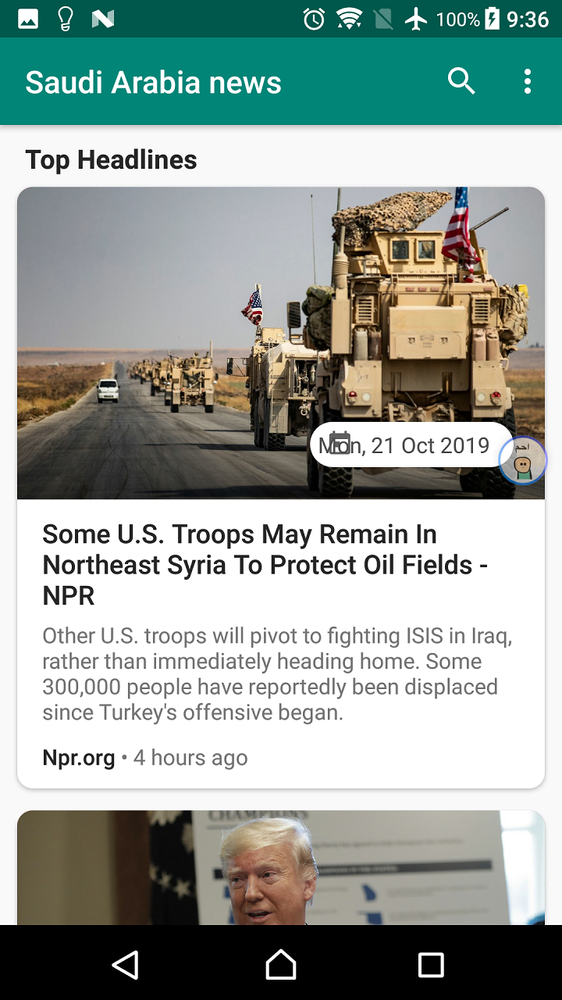
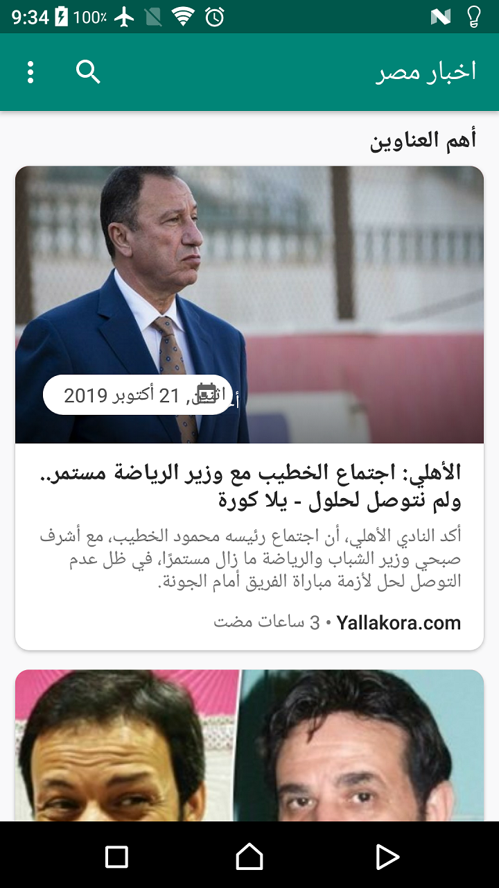
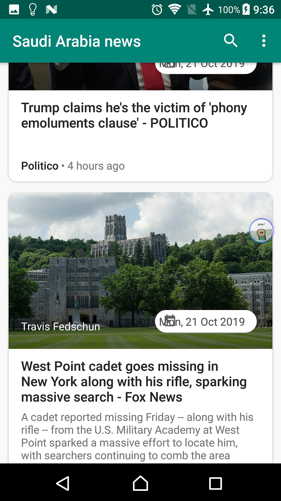
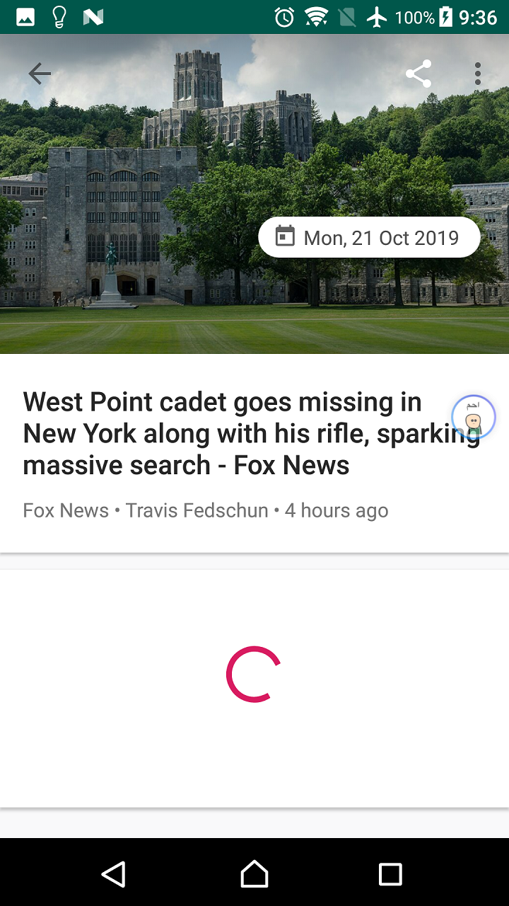
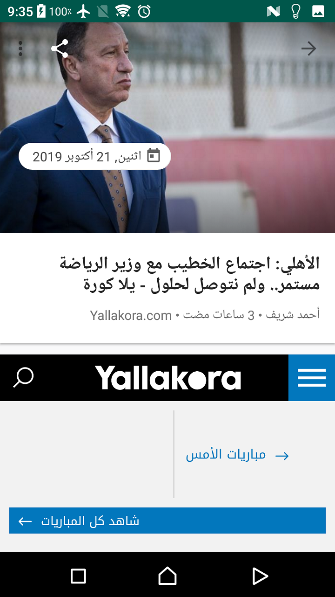
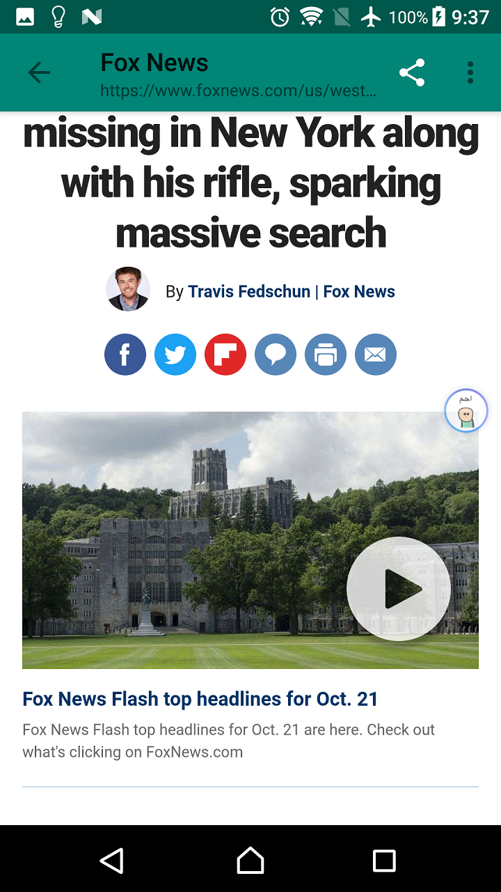
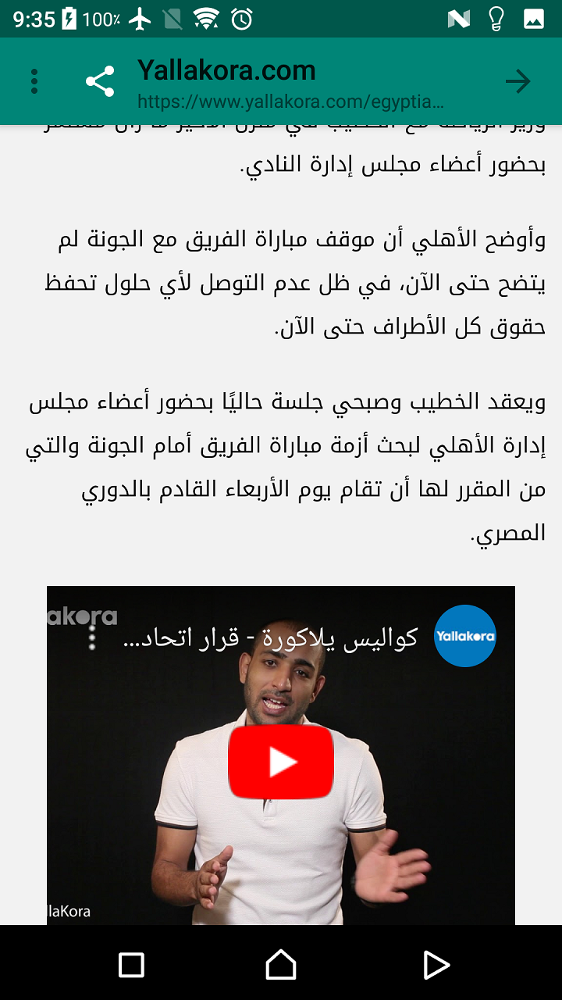

## NewsApp
The structure of a news app which gives a user regularly-updated news from the Internet related to a particular location.
Project which comes under Udacity Android Basics Nanodegree Program .

## Project Overview
The goal is to create a News Feed app which gives a user regularly-updated news from the Internet related to a particular topic, person, or location. The presentation of the information as well as the topic is up to you.

## What will i learn?
In the most recent portion of the Nanodegree program, you worked to build the News app. Along the way, you learned about connecting to the Internet in Android, parsing responses from an API, updating the information in your app, and properly displaying that information. Practicing these skills is imperative in order to build apps that delight and surprise users by anticipating their needs and supplying them with relevant information.

## Requirements
. App contains a main screen which displays multiple news stories
. Each list item on the main screen displays relevant text and information about the story.
. The title of the article and the name of the section that it belongs to are required field.
. If available, author name and date published should be included. Please note not all responses will contain these pieces of data, but it is required to include them if they are present.

## Final Output - Screenshots
English                         | Arabic
:--------------------------------:|:--------------------------------:
  |
  |
  |
  |

# Download
You can download the apk here [NewsApp](../../raw/master/app/screenshots/app-debug.apk)
